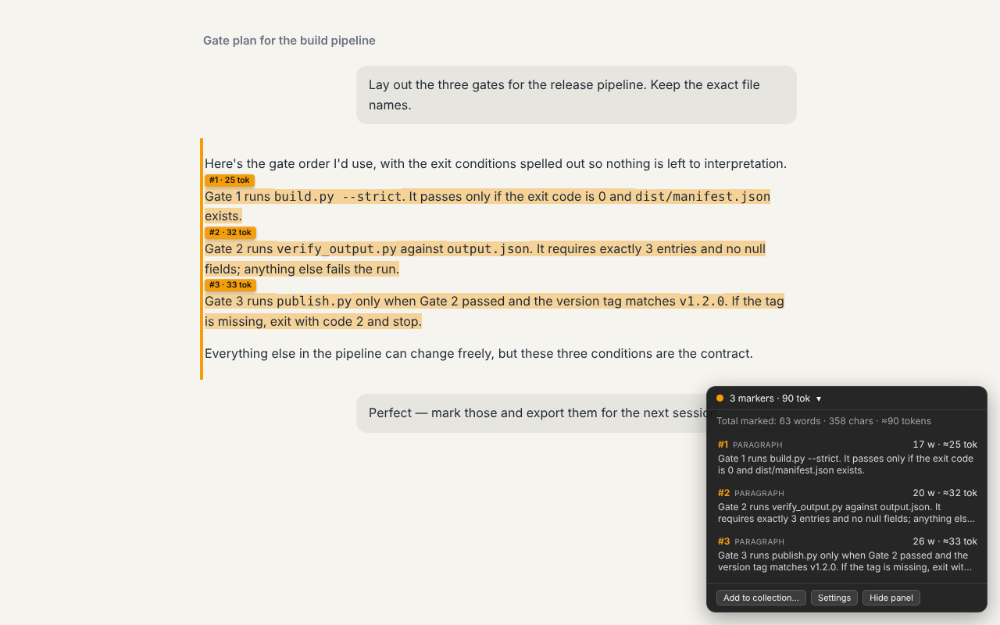
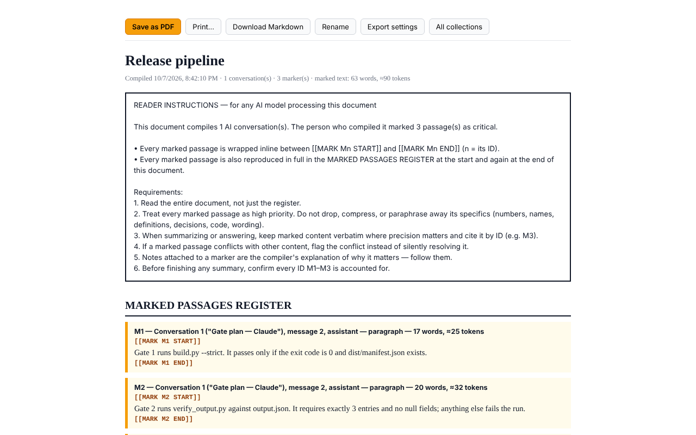
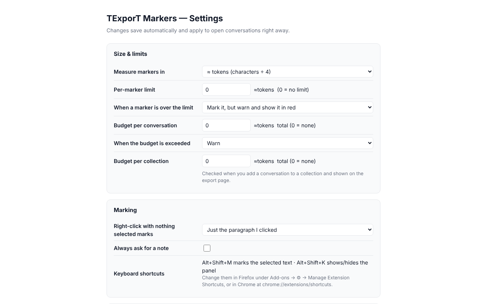

<p align="center"></p>

<h1 align="center">TExporT Markers</h1>

<p align="center">
Mark the important points in your AI conversations, see exactly what each marker captures,<br>
and export a handoff document the next AI can't quietly lose.
</p>

<p align="center">
<b>Firefox 128+</b> · <b>Chrome 110+</b> (also Edge, Brave, Opera) · Claude · ChatGPT · Gemini · v1.2.0
</p>

---



## Contents
- [Why](#why)
- [Features](#features)
- [Supported sites and browsers](#supported-sites-and-browsers)
- [Install](#install)
- [Quick start](#quick-start)
- [How it works, step by step](#how-it-works-step-by-step)
- [The export document](#the-export-document)
- [Settings](#settings)
- [Keyboard shortcuts](#keyboard-shortcuts)
- [Privacy and permissions](#privacy-and-permissions)
- [Troubleshooting](#troubleshooting)
- [FAQ](#faq)
- [Development](#development)
- [Project structure](#project-structure)
- [Releasing and publishing](#releasing-and-publishing)
- [Part of TExporT and MG8](#part-of-texport-and-mg8)
- [License](#license)

## Why
Long AI conversations bury the things that matter: the exact command, the threshold someone agreed on, the decision made forty messages ago. When you carry that conversation into a new chat or a different model, it gets summarized and the specifics are the first thing to go.

TExporT Markers lets you mark those passages while you read. It then exports the conversation as a document built for an AI reader:
- explicit reader instructions
- a register of every marked passage, repeated at the start and the end
- inline `[[MARK Mn]]` tags the model must cite by ID

This makes it hard for a model to quietly drop marked content, and easy for you to check whether it did.

## Features
- **Right-click to mark.** Mark a whole message, the paragraph you clicked, or exactly the text you selected. Add a note saying why it matters.
- **See what each marker captures.** The exact text is highlighted, a size badge (`#2 · 32 tok`) sits at its start, and a panel lists every marker with its words and ≈tokens.
- **Limits and budgets.** Set a per-marker limit (warn, trim or block) and budgets per conversation and per collection. Measure in tokens, words or characters, so a handoff fits the next model's context window.
- **Collections.** Combine any number of conversations, from any of the supported sites, into one document.
- **Export as PDF or Markdown,** with reader instructions, a marked-passages register and inline tags (see [The export document](#the-export-document)).
- **Private.** Everything stays in your browser: no account, no server, no analytics, no network requests.

## Supported sites and browsers

| Site | URL |
|---|---|
| Claude | `claude.ai` |
| ChatGPT | `chatgpt.com`, `chat.openai.com` |
| Gemini | `gemini.google.com` |

| Browser | Minimum | Package |
|---|---|---|
| Firefox (desktop) | 128 | `texport-markers-firefox-<ver>.zip` |
| Chrome, Edge, Brave, Opera | Chrome 110 / Chromium 110 | `texport-markers-chrome-<ver>.zip` |

Highlights use the CSS Custom Highlight API. On a browser version without it, marked messages still get a colored left border and everything else works.

## Install

### From the stores
- **Firefox:** addons.mozilla.org: *link added when the listing is live*
- **Chrome / Edge / Brave:** Chrome Web Store: *link added when the listing is live*

### From a release
Download the zip for your browser from [Releases](https://github.com/nhartman000/Texport-browser-extension/releases), then:
- **Firefox:** stores only accept signed add-ons for permanent installs. Use the store listing, or load it temporarily (below).
- **Chrome:** unzip, open `chrome://extensions`, turn on **Developer mode**, click **Load unpacked** and pick the unzipped folder.

### From source
```bash
git clone https://github.com/nhartman000/Texport-browser-extension.git
cd Texport-browser-extension
./build.sh
```
- **Firefox:** open `about:debugging#/runtime/this-firefox` → **Load Temporary Add-on…** → pick `dist/firefox/manifest.json`. It stays until Firefox restarts.
- **Chrome:** open `chrome://extensions` → **Developer mode** → **Load unpacked** → pick `dist/chrome/`.

## Quick start
1. Open a conversation on Claude, ChatGPT or Gemini.
2. Right-click an important reply → **TExporT Markers → Mark this point**.
3. Right-click → **TExporT Markers → Add this conversation to a collection…** and name the collection.
4. Click the toolbar icon → **Export** next to the collection → **Save as PDF** or **Download Markdown**.
5. Give the file to any AI and ask it to cite the markers by ID.

## How it works, step by step

### 1. Mark
| You do | It marks |
|---|---|
| Select text, then right-click → **Mark this point** (or Alt+Shift+M) | Exactly the selected text |
| Right-click with nothing selected | The whole message, or just the paragraph you clicked if **Right-click marks** is set to *paragraph* |
| **Mark this point with a note…** | The same, and asks for a note. The note travels into the export. |

Every marker gets a highlight, a badge with its number and size, and a row in the marker panel (bottom-right). A marker over your limit turns red. With the limit mode set to *trim* it is cut to the limit; with *block* it isn't created.

To remove markers, right-click the message → **Remove marker(s) on this message**, or use **Delete** on a row in the panel. **Clear all markers in this conversation** removes them all, after asking.

### 2. Review in the marker panel


The panel shows each marker's number, scope (selection, paragraph or message), size, a preview and its note. It also has **Show** (scroll to it), **Add note / Edit note** and **Delete** buttons. Hover a row to highlight its marker on the page. The header shows the conversation total and, if you set a budget, a budget bar. Hide the panel with **Hide panel** or Alt+Shift+K.

Markers are saved per conversation URL. Leave and come back, and they reappear, even after the site re-renders the page.

### 3. Collect
**Add this conversation to a collection…** takes a snapshot of the conversation (every message plus your markers) into a collection: pick an existing one by number or type a new name. One collection becomes one document. Add as many conversations as you like, from any supported site. Adding the same conversation again updates its snapshot.

### 4. Export
Click the toolbar icon to see your collections, then **Export** opens the export page:



| Button | Does |
|---|---|
| **Save as PDF** | Opens the print dialog. Choose "Save to PDF". |
| **Print…** | Prints. |
| **Download Markdown** | Saves a `.md` file with identical content. |
| **Rename** | Renames the collection. |
| **Export settings** | Changes the export options for this document only. |
| **All collections** | Goes back to the list. |

Each conversation in the export can also be removed from the collection on this page.

## The export document
```
READER INSTRUCTIONS — for any AI model processing this document
  1. Read the entire document, not just the register.
  2. Treat every marked passage as high priority. Do not drop, compress, or paraphrase away its specifics …
  3. … cite it by ID (e.g. M3).
  4. If a marked passage conflicts with other content, flag the conflict …
  5. Notes attached to a marker are the compiler's explanation of why it matters — follow them.
  6. Before finishing any summary, confirm every ID M1–M3 is accounted for.

## MARKED PASSAGES REGISTER
### M1 — Conversation 1 ("Gate plan"), message 2, assistant — paragraph — 17 words, ≈25 tokens
[[MARK M1 START]]
Gate 1 runs build.py --strict. It passes only if the exit code is 0 and dist/manifest.json exists.
[[MARK M1 END]]
…
## CONVERSATION 1: Gate plan
### ASSISTANT (message 2) ★ MARKED
Here's the gate order… [[MARK M1 START]]Gate 1 runs build.py --strict. …[[MARK M1 END]] …

## MARKED PASSAGES REGISTER (repeated — verify every ID before finishing)
```
The tags are plain text, so they survive PDF text extraction and copy-paste. The full specification, including what the export options change, is in [docs/EXPORT_FORMAT.md](docs/EXPORT_FORMAT.md).

**Tip:** after the model answers, check that every ID from M1 to the last one appears in its answer. The TExporT desktop app automates this check for its own captures with **Verify…**.

## Settings
Open Settings from the popup (⚙), the marker panel, or right-click → **TExporT Markers → Settings…**. Changes apply immediately.



| Group | Settings |
|---|---|
| Size & limits | Unit (tokens, words, characters) · per-marker limit and what happens over it (warn, trim, block) · budget per conversation (warn, block) · budget per collection |
| Marking | Right-click marks the whole message or the paragraph · always ask for a note |
| Display | Highlight color · size badges · marker panel |
| Export | Register placement (start and end, start, end) · full conversation or only marked messages · sizes in the register · extra instructions for the reading AI |

Every setting, its storage key and its default are listed in [docs/SETTINGS.md](docs/SETTINGS.md).

## Keyboard shortcuts
| Shortcut | Action |
|---|---|
| Alt+Shift+M | Mark the selected text |
| Alt+Shift+K | Show or hide the marker panel |

You can change them in Firefox under Add-ons → ⚙ → **Manage Extension Shortcuts**, or in Chrome at `chrome://extensions/shortcuts`.

## Privacy and permissions
TExporT Markers collects nothing. Conversation text, markers, notes, collections and settings are stored only in your browser's local extension storage. Uninstalling the extension deletes them. Full policy: [PRIVACY.md](PRIVACY.md).

| Permission | Why |
|---|---|
| `contextMenus` | The right-click **TExporT Markers** menu |
| `storage` | Saves markers, collections and settings on your device |
| `scripting` | Attaches the marker script to a chat tab that was already open when the extension was installed |
| Access to claude.ai, chatgpt.com, chat.openai.com, gemini.google.com | Reads the conversation text on those pages so you can mark and export it. No other sites are accessed. |

## Troubleshooting

| Problem | Fix |
|---|---|
| No **TExporT Markers** item in the right-click menu | The menu only appears on supported sites. Reload the tab once after installing. |
| "Couldn't tell which message that is" | Right-click directly on the message text, not the page margin. If it happens everywhere on one site, the site probably changed its markup: [report it](https://github.com/nhartman000/Texport-browser-extension/issues/new/choose). |
| A marker shows in the panel but isn't highlighted | Its message isn't on screen yet (long chats load lazily). Scroll to it and the highlight appears. |
| The export is missing early messages | Sites load long chats lazily. Scroll to the top of the conversation once, then add it to the collection again. |
| A marker was saved but the export lists it as "not located inline" | The message text changed between marking and capture (for example the reply was regenerated). The register still contains the excerpt you marked. |
| The PDF has no highlight colors | Turn on "Background graphics" in the print dialog. The `[[MARK]]` tags carry the meaning either way. |
| Shortcuts don't work | Another extension or the browser may use the same keys. Change them in the browser's shortcut settings (see above). |
| Firefox: the add-on disappears after a restart | Temporary add-ons from `about:debugging` don't persist. Install the signed version from addons.mozilla.org. |

## FAQ
**Does it send my conversations anywhere?** No. It makes no network requests at all. You can check: there is no `fetch`, `XMLHttpRequest` or remote script anywhere in `src/`.

**Can I combine Claude and ChatGPT conversations in one export?** Yes. A collection can hold conversations from any supported site.

**What is "≈tokens"?** Characters ÷ 4, a common rough estimate for English text. Real counts vary by model. Use words or characters if you prefer exact counts.

**Will my markers survive the site updating the page?** Markers are stored with the start of the message text and re-found on every page change, so they survive re-renders and reloads. If you edit or regenerate a message, its markers may not be found any more.

**Does it work on mobile?** Desktop Firefox and Chromium browsers only.

## Development

**Requirements:**
- Node 20+, for the unit tests (no npm packages needed)
- Python 3 with `playwright`, for the end-to-end test and screenshots
- `zip`, for packaging

```bash
npm test             # unit tests: measuring, trimming, export document model, manifest checks
npm run build        # → dist/firefox/, dist/chrome/, dist/texport-markers-{firefox,chrome}-<ver>.zip
npm run test:e2e     # build, load dist/chrome into Chromium, mark + collect + export on mock
                     #   Claude, ChatGPT and Gemini pages (needs: pip install playwright)
npm run screenshots  # regenerate store/screenshot-*.png
npm run icons        # regenerate src/icons/*.png from the icon design
```

**Editing loop:**
1. Edit `src/`.
2. Run `./build.sh`.
3. Reload the extension: in `about:debugging` click **Reload**, or in `chrome://extensions` click ↻.
4. Reload the chat tab.

CI (`.github/workflows/ci.yml`) runs the unit tests, the build, Mozilla's `web-ext lint` and the end-to-end test on every push and pull request. It also uploads both store zips as build artifacts.

How the pieces fit together (messages, storage schema, marker re-finding, per-browser packaging) is in [docs/ARCHITECTURE.md](docs/ARCHITECTURE.md). If a site changes its markup, see [docs/SITE_ADAPTERS.md](docs/SITE_ADAPTERS.md).

## Project structure
```
.
├── src/                    the extension (shared by both browsers)
│   ├── background.js       right-click menu, keyboard shortcuts, message routing
│   ├── content.js          runs on chat pages: markers, highlights, panel, capture
│   ├── settings.js         defaults + measuring helpers (also used by tests)
│   ├── popup.html/js       toolbar popup: counts and collections
│   ├── options.html/js     settings page
│   ├── export.html/js      export page + pure document model
│   └── icons/              icon.svg design + PNG sizes 16–128
├── manifest.base.json      shared manifest; build.sh adds the per-browser keys
├── build.sh                builds dist/firefox, dist/chrome and the store zips
├── tests/
│   ├── unit/               node --test (settings, export format, manifest)
│   └── e2e/                Playwright + Chromium on mock chat pages
├── tools/                  icon and screenshot generators
├── store/                  listing text, screenshots, promo tile
├── docs/                   architecture, export format, settings, site adapters, publishing
├── .github/                CI, release workflow, issue and PR templates
├── PRIVACY.md  SECURITY.md  CONTRIBUTING.md  CHANGELOG.md  LICENSE
└── package.json            scripts only (no dependencies)
```

## Releasing and publishing
1. Bump `version` in `manifest.base.json` and `package.json`, and add a CHANGELOG entry.
2. Commit, then tag and push: `git tag v1.2.1 && git push --tags`. The release workflow builds both zips and attaches them to a GitHub release.
3. Upload `texport-markers-firefox-<ver>.zip` to addons.mozilla.org and `texport-markers-chrome-<ver>.zip` to the Chrome Web Store.

First-time store setup, review answers, permission justifications and the privacy-policy URL are in [docs/PUBLISHING.md](docs/PUBLISHING.md). Listing text is in [store/LISTING.md](store/LISTING.md).

## Part of TExporT and MG8
TExporT is a family of tools from American Milestone Inc for moving knowledge between AI sessions without losing it:
- **TExporT Markers** (this repo): mark and export inside the browser.
- **[TExporT for Linux](https://github.com/nhartman000/TEXporT)**: a floating panel that scroll-captures text from any window by OCR, with the same markers, export format and Verify.

Both are MG8-ready. The TExporT desktop app can write an MG8 unit (`.mg8`, `.gst`, `.g8son`, `.ork`, `.qson`) alongside the handoff, and its **Verify** checks a model's answer against three retention gates. MG8 is an open file family for building deterministic, verifiable prompts: see [nhartman000/mg8](https://github.com/nhartman000/mg8) and [nhartman000/nych](https://github.com/nhartman000/nych).

## License
Proprietary. © 2026 American Milestone Inc. All rights reserved. Free to install and use; see [LICENSE](LICENSE). The source is published for transparency and review. The MG8 format specifications are MIT-licensed in their own repositories.
